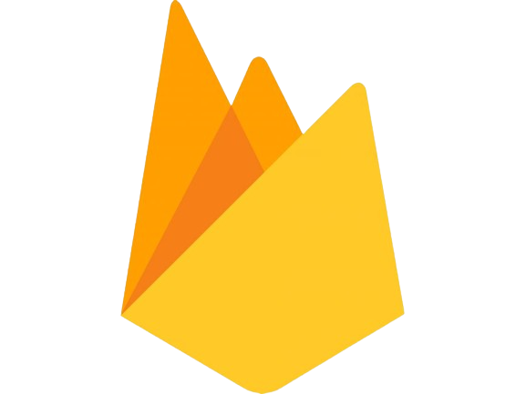

# Hi there! 👋 I'm Abdur Razzak Parvej

I'm a passionate MERN stack developer with a year of experience in web development. Welcome to my GitHub profile!

## About Me

As a passionate MERN stack developer with over a year of hands-on experience, I thrive on turning ideas into responsive and user-friendly web applications. My journey began with mastering the fundamentals of HTML, CSS, and JavaScript, which laid a strong foundation for my transition to building dynamic front-end interfaces with React.js and optimizing backend functionalities with Node.js and MongoDB. I enjoy collaborating with teams to tackle challenges and continuously learning new technologies to stay ahead in the rapidly evolving tech landscape.

## My Skills

> Tools, languages, and other things that I like to work with.

<table>
  <tr>
    <td align="center" width="96">
      
       HTML
    </td>
    <td align="center" width="96">
      
       CSS
    </td>
    <td align="center" width="96">
      
       Javascript
    </td>
    <td align="center" width="96">
      
       Tailwind
    </td>
    <td align="center" width="96">
      
       React
    </td>
    <td align="center" width="96">
      
       Mongodb
    </td>
    <td align="center" width="96">
      
       Firebase
    </td>
  </tr>
</table>

## Current Stats

 

  

## Connect with Me

- LinkedIn: [Your LinkedIn Profile](LinkedIn URL)
- Twitter: [Your Twitter Profile](Twitter URL)
- Website: [Your Website](Your Website URL)

## Fun Fact

💻 Fun fact: I'm so passionate about programming that I often find myself debugging code in my dreams!
